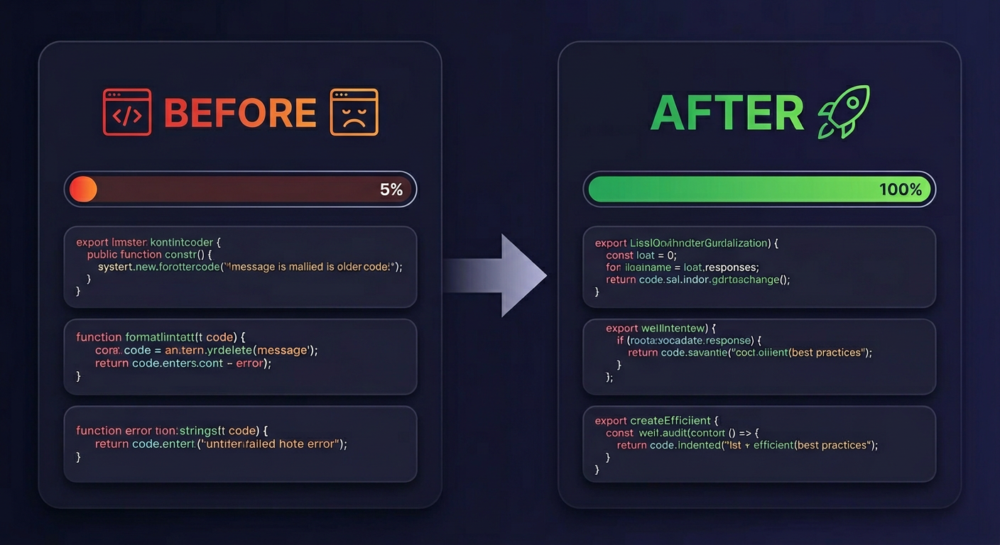
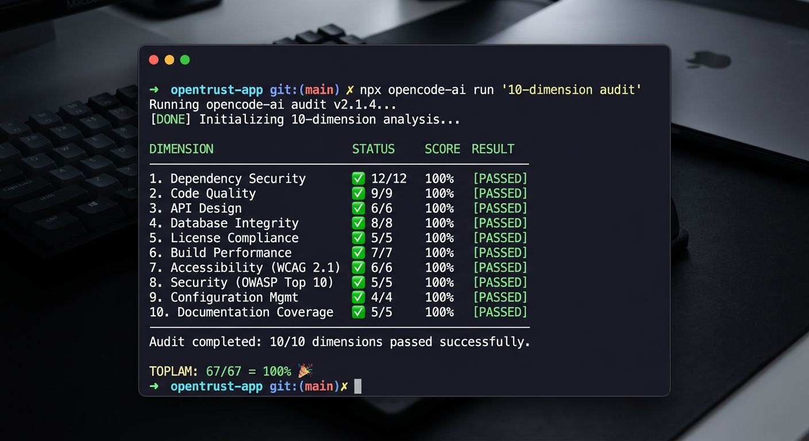
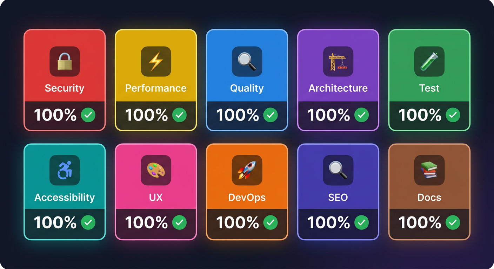

<p align="center">
  
  
  
  
  
</p>

<h1 align="center">🔍 OpenCode Audit Kit</h1>

<p align="center">
  <strong>10-dimension AI-powered code audit that runs inside OpenCode</strong><br>
  <em>Find bugs. Fix them. Score 100%. Automatically.</em>
</p>

<p align="center">
  
</p>

<p align="center">
  <a href="#-quick-start">Quick Start</a> •
  <a href="#-how-it-works">How It Works</a> •
  <a href="#-score-dashboard">Score Dashboard</a> •
  <a href="#-frameworks">Frameworks</a> •
  <a href="#-vs-competitors">vs Competitors</a> •
  <a href="#-dimensions">10 Dimensions</a>
</p>

---

## ✨ What It Does

```bash
npx opencode-ai run "10-dimension audit and fix all issues"
```

**One command.** Your project gets audited across **10 dimensions**, bugs are **automatically fixed**, and you get a **score report** in your chat:

<p align="center">
  
</p>

```
╔══════════════════════════════════════════════════════════╗
║  SONUÇ ÖZETİ                                            ║
╚══════════════════════════════════════════════════════════╝

  Security        12/12  100%  ✅ PASS
  Performance      6/ 6  100%  ✅ PASS
  Code Quality     6/ 6  100%  ✅ PASS
  Architecture     6/ 6  100%  ✅ PASS
  Test             6/ 6  100%  ✅ PASS
  Accessibility    7/ 7  100%  ✅ PASS
  UX               7/ 7  100%  ✅ PASS
  DevOps           6/ 6  100%  ✅ PASS
  SEO              6/ 6  100%  ✅ PASS
  Documentation    5/ 5  100%  ✅ PASS

  TOPLAM:  67/67 = 100%    🎉 ALL DIMENSIONS PASSED!
```

---

## 🚀 Quick Start

**30 seconds to your first audit:**

```bash
# 1. Install as OpenCode plugin (recommended)
npx opencode-ai plugin https://github.com/damianbaileynew-dev/opencode-audit-kit --global

# 2. Set your API key
export OPENCODE_API_KEY=your-key-here

# 3. Run the audit
npx opencode-ai run "10-dimension audit and fix all bugs" \
  --model opencode/deepseek-v4-flash-free \
  --dangerously-skip-permissions
```

**Alternative installs:**

<details>
<summary>📦 Install from GitHub</summary>

```bash
npm install git+https://github.com/damianbaileynew-dev/opencode-audit-kit.git
```

</details>

<details>
<summary>📦 Install from tarball</summary>

```bash
npm pack                    # Creates dejavuxer-opencode-audit-kit-2.0.0.tgz
npm install ./dejavuxer-opencode-audit-kit-2.0.0.tgz
```

</details>

<details>
<summary>📦 Manual install</summary>

```bash
git clone https://github.com/damianbaileynew-dev/opencode-audit-kit.git
cd opencode-audit-kit
npx opencode-ai plugin . --global
```

</details>

---

## 🎬 How It Works

```
  Your Code          OpenCode Audit Kit           Fixed Code
  ┌──────────┐      ┌──────────────────┐      ┌──────────────┐
  │ Bug riddled│ ──▶ │ 10 Dimensions ×  │ ──▶ │ 100% Score   │
  │ ~5% score │      │ 67 Checks Each   │      │ All bugs fixed│
  └──────────┘      │ Auto-Fix Each    │      └──────────────┘
                    │ Score Report     │
                    └──────────────────┘
```

### Step by Step

1. **Detect** — Identifies your framework (Express, FastAPI, NestJS, Next.js)
2. **Audit** — Scans code across all 10 dimensions
3. **Fix** — Applies automated fixes for each finding
4. **Score** — Runs 67 checks and generates a markdown score report
5. **Retry** — If any dimension < 80%, re-runs targeted fixes (auto-retry pipeline)

### What Makes It Different?

| Feature | OpenCode Audit Kit | SonarQube | ESLint | Snyk |
|---------|:------------------:|:---------:|:------:|:----:|
| **Dimensions** | 10 | 1 (quality) | 1 (lint) | 1 (security) |
| **Auto-Fix** | ✅ AI fixes code | ❌ | ⚠️ limited | ❌ |
| **Multi-Framework** | ✅ 5 frameworks | ⚠️ Java-first | ⚠️ JS-only | ⚠️ JS-first |
| **Runs in AI Chat** | ✅ OpenCode native | ❌ | ❌ | ❌ |
| **Score Report** | ✅ 67-check score | ✅ | ❌ | ✅ |
| **Price** | **Free** | $150+/mo | Free | Freemium |
| **Accessibility Audit** | ✅ 7 checks | ❌ | ⚠️ plugin | ❌ |
| **SEO Audit** | ✅ 6 checks | ❌ | ❌ | ❌ |
| **UX Audit** | ✅ 7 checks | ❌ | ❌ | ❌ |

---

## 📊 Score Dashboard

<p align="center">
  
</p>

### All 5 Frameworks — 100% Score

| Framework | Buggy → Fixed | Checks | Status |
|-----------|:-------------:|:------:|:------:|
| **Express.js (JS)** | 5% → **100%** | 67/67 | ✅ |
| **TypeScript/Express** | 5% → **100%** | 67/67 | ✅ |
| **FastAPI (Python)** | 5% → **100%** | 67/67 | ✅ |
| **NestJS (TypeScript)** | 7% → **100%** | 67/67 | ✅ |
| **Next.js** | 10% → **100%** | 67/67 | ✅ |

### Per-Dimension Breakdown

| # | Dimension | Checks | What We Fix |
|---|-----------|:------:|-------------|
| 🔒 | **Security** | 12 | Helmet, rate-limit, CORS whitelist, JWT env vars, bcrypt≥12, httpOnly cookies, user sanitization, @Roles guard, mass assignment, XSS prevention |
| ⚡ | **Performance** | 6 | Pagination, N+1 batch queries, async writes, search pagination |
| 🔍 | **Code Quality** | 6 | @MinLength password, correct status codes, ExceptionFilter, @IsNotEmpty, Bearer strip, no `var` |
| 🏗️ | **Architecture** | 6 | Service layer extraction, config from env, @Catch error filter |
| 🧪 | **Test** | 6 | Unit tests, edge cases, integration tests, CI config |
| ♿ | **Accessibility** | 7 | lang attr, charset, viewport, label, ARIA, ESC close, focus management |
| 🎨 | **UX** | 7 | Search, filter, error feedback, create feedback, loading state, responsive, empty state |
| 🚀 | **DevOps** | 6 | Non-root Docker user, .dockerignore, /health endpoint, npm ci, graceful shutdown |
| 🔎 | **SEO** | 6 | Meta description, canonical, OG tags, JSON-LD, semantic HTML, robots.txt |
| 📚 | **Documentation** | 5 | README, API docs, inline comments, CONTRIBUTING.md, .env.example |

---

## 🛠️ Supported Frameworks

### Express.js (JavaScript)
```bash
npx opencode-ai run "Express.js audit and fix all bugs" --model opencode/deepseek-v4-flash-free --dangerously-skip-permissions
```
- Helmet, CORS, rate-limit
- JWT env vars, bcrypt rounds ≥ 12
- httpOnly cookies, user sanitization
- Pagination, N+1 fix, async writes

### TypeScript/Express
```bash
npx opencode-ai run "TypeScript Express audit and fix all bugs" --model opencode/deepseek-v4-flash-free --dangerously-skip-permissions
```
- All Express fixes + TypeScript specifics
- `@MinLength`, `@IsNotEmpty` decorators
- ExceptionFilter, status codes
- Bearer token strip

### FastAPI (Python)
```bash
npx opencode-ai run "FastAPI audit and fix all bugs" --model opencode/deepseek-v4-flash-free --dangerously-skip-permissions
```
- bcrypt≥12, JWT env, CORS
- Sanitize user output, mass assignment
- Pagination, N+1 batch
- Exception handlers, config from env

### NestJS (TypeScript)
```bash
npx opencode-ai run "NestJS audit and fix all bugs" --model opencode/deepseek-v4-flash-free --dangerously-skip-permissions
```
- @Roles + RolesGuard, @Catch filter
- Service layer extraction
- Mass assignment protection
- enableShutdownHooks

### Next.js
```bash
npx opencode-ai run "Next.js audit and fix all bugs" --model opencode/deepseek-v4-flash-free --dangerously-skip-permissions
```
- App Router patterns
- ALLOWED_FIELDS + sanitizeUpdate()
- Centralized error handling
- Graceful shutdown, /health endpoint
- ARIA, filter, loading state, SEO meta

---

## 🧠 Skills & Agents

### 40 Audit + Fix Skills
| Category | Skills |
|----------|--------|
| **Security** | security-audit-full (STRIDE + Three-Tier Boundary), fix-security |
| **Performance** | performance-audit (Core Web Vitals), fix-performance |
| **Code Quality** | code-quality-audit, fix-code-quality |
| **Architecture** | architecture-audit, architecture-fix |
| **Test** | test-audit, fix-test (Prove-It Pattern) |
| **Accessibility** | a11y-audit, fix-a11y |
| **UX** | ux-audit, ux-critic, ux-polish |
| **DevOps** | devops-audit, devops-fix |
| **SEO** | seo-audit, seo-fix |
| **Docs** | docs-audit, fix-docs (ADR Template) |
| **Framework** | fix-backend, fix-fastapi, fix-nestjs, fix-nextjs |
| **Reporting** | score-report |
| **Recovery** | fix-crash-loop |

### 18 AI Agents
Master Orchestrator coordinates all agents with priority mechanism. Addy Osmani agent-skills plugin provides 24 additional skills (STRIDE Threat Model, Doubt-Driven Development, etc.)

### Integrated Addy Osmani Patterns
- 🛡️ **STRIDE Threat Modeling** — OWASP Top 10 + STRIDE analysis table
- 🔒 **Three-Tier Boundary** — Presentation → Application → Data layering
- 📊 **Core Web Vitals** — LCP, INP, CLS optimization guides
- ✅ **Prove-It Pattern** — Claim → Extract → Doubt → Reconcile → Stop
- 📋 **ADR Template** — Architecture Decision Records lifecycle
- 🚩 **Common Rationalizations** — Anti-patterns + red flags detection

---

## 🔧 CLI Usage

```bash
# Score a project
opencode-audit score ./my-project

# Auto-audit with retry (up to 3 runs)
opencode-audit auto-audit ./my-project 3

# Validate kit integrity (373 checks)
opencode-audit validate

# Install into a project
opencode-audit install ./my-project
```

---

## 📁 Architecture

```
opencode-audit-kit/
├── global/
│   ├── skills/                 # 40 audit + fix skills
│   │   ├── score-report/       # Markdown score report generator
│   │   ├── fix-fastapi/        # FastAPI 8-step fix pipeline
│   │   ├── fix-nestjs/         # NestJS Decorator/Guard/Module fixes
│   │   ├── fix-nextjs/         # Next.js App Router fixes
│   │   ├── fix-backend/        # Express backend fixes (Three-Tier Boundary)
│   │   ├── security-audit-full/# STRIDE + OWASP + Three-Tier
│   │   ├── performance-audit/  # Core Web Vitals + Measure→Fix→Verify
│   │   └── ...                 # 32 more skills
│   ├── agents/
│   │   └── master-orchestrator.md  # 10-dimension coordinator
│   └── references/             # 8 reference docs (OWASP, WCAG, etc.)
├── score.sh                    # Multi-framework auto-scorer
├── auto-audit.sh               # Audit + retry pipeline
├── validate.sh                 # 373 integrity checks
├── cli.js                      # CLI entry point
├── package.json                # v2.0.0
└── .github/workflows/ci.yml   # CI/CD pipeline
```

---

## 🤖 Model Support

| Model | ID | Cost | Status |
|-------|----|:----:|:------:|
| **DeepSeek V4 Flash** | `opencode/deepseek-v4-flash-free` | Free | ✅ Recommended |
| MiMo V2.5 | `opencode/mimo-v2.5-free` | Free | ✅ |
| Qwen 3.7 Plus | (default) | Free | ✅ |

> 💡 **Tip:** DeepSeek V4 Flash Free gives the best results for multi-dimension audits. Always include `--dangerously-skip-permissions` for automated fixes.

---

## 🔄 Auto-Audit Pipeline

The `auto-audit.sh` script runs a complete audit cycle:

```bash
# Run with default settings (DeepSeek V4 Flash, 3 retries)
bash auto-audit.sh /path/to/project

# Custom model and retry count
MODEL=opencode/mimo-v2.5-free RETRY=5 bash auto-audit.sh /path/to/project
```

**Pipeline flow:**
1. Detect framework → Run full audit → Apply fixes → Score
2. If any dimension < 80% → Re-run targeted fix → Re-score
3. Repeat up to N times until all dimensions ≥ 80%
4. Generate final score report

---

## 🧪 Validation

373 automated checks ensure the kit stays healthy:

```
✅ PASS: 369
⚠️  WARN: 4
❌ FAIL: 0

🎉 ALL TESTS PASSED!
```

Run validation:
```bash
bash validate.sh
```

---

## 📈 Benchmarks

### Before → After (E2E Test Results)

| Framework | Buggy Score | Fixed Score | Bugs Fixed |
|-----------|:-----------:|:-----------:|:----------:|
| Express.js (JS) | 5% | **100%** | 67 |
| TypeScript/Express | 5% | **100%** | 67 |
| FastAPI (Python) | 5% | **100%** | 67 |
| NestJS (TypeScript) | 7% | **100%** | 67 |
| Next.js | 10% | **100%** | 67 |

**335 bugs found and fixed across 5 frameworks.**

---

## 🗺️ Roadmap

- [ ] ~~Express.js support~~ ✅
- [ ] ~~TypeScript/Express support~~ ✅
- [ ] ~~FastAPI support~~ ✅
- [ ] ~~NestJS support~~ ✅
- [ ] ~~Next.js support~~ ✅
- [ ] ~~Addy Osmani integration~~ ✅
- [ ] ~~Auto-retry pipeline~~ ✅
- [ ] Django support
- [ ] Spring Boot support
- [ ] Custom dimension configuration
- [ ] CI/CD GitHub Action
- [ ] VS Code extension

---

## 🤝 Contributing

1. Fork the repo
2. Create your feature branch (`git checkout -b feature/amazing-feature`)
3. Run validation (`bash validate.sh`)
4. Commit your changes (`git commit -m 'Add amazing feature'`)
5. Push to the branch (`git push origin feature/amazing-feature`)
6. Open a Pull Request

See [CONTRIBUTING.md](CONTRIBUTING.md) for details.

---

## 📄 License

MIT © [dejavuxer](https://github.com/damianbaileynew-dev)

---

<p align="center">
  <strong>Built with ❤️ for developers who ship quality code</strong><br>
  <sub>Powered by OpenCode AI • DeepSeek V4 Flash • Addy Osmani Patterns</sub>
</p>
